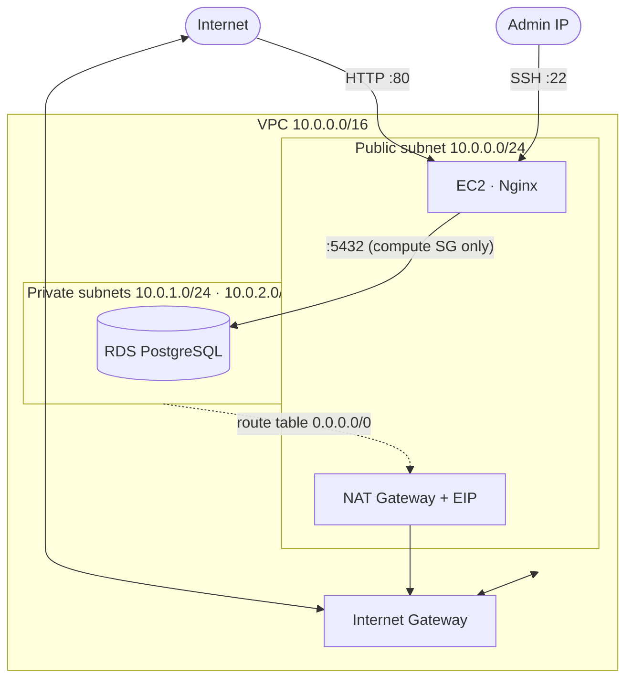

# HUG Terraform Challenge — Week Three

A secure, two-tier application on AWS provisioned with Terraform: an Nginx web
server in a public subnet and a PostgreSQL RDS database in private subnets, with
least-privilege security groups and remote state.

## Architecture



- **Public route table** routes `0.0.0.0/0` to the Internet Gateway.
- **Private route table** routes `0.0.0.0/0` to the NAT Gateway (egress only).
- The DB subnet group contains **two** private subnets in separate Availability
  Zones (required by RDS). Because `multi_az = false`, the Single-AZ RDS instance
  is placed in one of those subnets.

## Module layout

| Module | Responsibility |
|--------|----------------|
| `modules/vpc` | VPC with DNS support/hostnames enabled |
| `modules/networking` | Subnets, IGW, NAT Gateway + EIP, route tables & associations |
| `modules/security_group` | Compute SG (SSH/HTTP) and Database SG (DB port from compute SG only) |
| `modules/instance` | EC2 web server; Ubuntu 22.04 LTS via AMI data source; Nginx via user_data |
| `modules/database` | RDS PostgreSQL, DB subnet group, `publicly_accessible = false` |
| `bootstrap/` | One-time S3 bucket for remote Terraform state |

## Security groups (least privilege)

- **Compute SG**: inbound `80/tcp` from `0.0.0.0/0`; inbound `22/tcp` from your IP
  only (`ssh_cidr`); all outbound.
- **Database SG**: inbound `5432/tcp` from the **compute SG** (source security
  group, not a CIDR); **no egress rules**. Security groups are stateful, so
  responses to connections initiated by the compute instance are allowed without
  an outbound rule. The DB is never publicly accessible.

## Prerequisites

- Terraform `>= 1.10.0`
- AWS CLI configured with a profile (default: `terraform-lab`)
- An AWS account with permissions for VPC, EC2, RDS, and S3

## Configuration

Create a `.env` file (gitignored) in the project root:

```dotenv
ENVIRONMENT=dev
TF_VAR_db_password=<a-strong-password>
```

The Makefile reads your SSH public key from `~/.ssh/id_ed25519.pub` by default
(override with `SSH_PUBLIC_KEY_FILE=/path/to/key.pub`).

> **`.env` parsing caveat.** The Makefile loads `.env` via `-include`, so GNU
> Make itself parses the file. Characters that are special to Make — `$`, `#`,
> leading/trailing whitespace, backslashes — can be interpreted unexpectedly in a
> password. If your password contains such characters, prefer exporting it in
> your shell instead:
>
> ```bash
> export TF_VAR_db_password='your-password'
> make plan
> ```

Key variables (see `main.tf` for the full list and defaults):

| Variable | Default | Description |
|----------|---------|-------------|
| `region` | `us-east-1` | AWS region |
| `vpc_cidr` | `10.0.0.0/16` | VPC CIDR |
| `public_cidr_block` | `10.0.0.0/24` | Public subnet CIDR |
| `private_cidr_blocks` | `["10.0.1.0/24","10.0.2.0/24"]` | Private subnet CIDRs |
| `instance_type` | `t3.micro` | EC2 instance type |
| `db_instance_class` | `db.t3.micro` | RDS instance class |
| `db_allocated_storage` | `20` | RDS storage (GiB) |
| `db_port` | `5432` | Database port |
| `db_password` | — | **Required**, provided via `.env` |
| `ssh_cidr` | — | Set automatically by the Makefile to your current IP's `/24` |
| `public_key` | `""` | SSH public key; the Makefile reads it from `SSH_PUBLIC_KEY_FILE` |

## Deployment

The `Makefile` wraps the full workflow.

```bash
# 1. Bootstrap the remote state bucket (one time) and initialise the backend
make setup

# 2. Review the plan (auto-detects your public IP for the SSH rule)
make plan

# 3. Apply
make apply

# ...or plan + apply in one step
make deploy

# 4. Verify the web server responds
make verify
```

`make plan` runs `terraform fmt` and `validate` first, detects your public IP
via `checkip.amazonaws.com`, and writes the SSH rule for the surrounding `/24`
block. A `/24` is used rather than a single `/32` because many ISPs rotate the
client IP within their block between requests; scoping to the `/24` keeps SSH
usable without opening it to the whole internet.

## SSH access

The Makefile imports your public key (`~/.ssh/id_ed25519.pub` by default) as an
EC2 key pair and attaches it to the instance. The compute security group permits
`22/tcp` from your current IP's `/24` block, so once applied you can connect with:

```bash
ssh -i ~/.ssh/id_ed25519 ubuntu@$(terraform output -raw instance_public_ip)
```

> **Note on best practice.** This project uses a classic SSH key pair with port
> 22 open to a restricted CIDR because the assignment requires it. In production,
> the industry-standard approach is **AWS Systems Manager (SSM) Session Manager**:
> attach an IAM instance profile with `AmazonSSMManagedInstanceCore`, keep port
> 22 **closed entirely**, install/enable the SSM agent, and connect with
> `aws ssm start-session`. That gives keyless, IAM-governed, fully audited access
> with no inbound SSH exposure and no private keys to manage. This instance sits
> in the public subnet, so its outbound path to the SSM endpoints is the Internet
> Gateway; a private instance would instead use the NAT gateway or interface VPC
> endpoints. SSM is deliberately left out here to match the brief.

## Outputs

| Output | Description |
|--------|-------------|
| `instance_public_ip` | Public IP of the Nginx web server |
| `vpc_id` | VPC id |
| `public_subnet_id` | Public subnet id |
| `private_subnet_ids` | Private subnet ids |
| `db_endpoint` | RDS connection endpoint |

## Teardown

```bash
make destroy          # destroy the application stack
make destroy-backend  # destroy the state bucket (after destroy)
make destroy-all      # both, in order
```

## Remote state

State is stored in an S3 bucket (versioned, encrypted, native lockfile) created
by the `bootstrap/` configuration. The backend `key` is
`hug-tf-week-three/terraform.tfstate`.

> **Single-environment scope.** `ENVIRONMENT` changes resource names/tags, but
> the backend `key` is fixed, so all environments share one state file. Switching
> `dev` → `staging` therefore mutates the same state rather than creating an
> independent environment. That is intentional for this single-environment
> challenge; separate environments would use separate backend keys, Terraform
> workspaces, or root configurations.

### Database password and state (lab tradeoff)

The `db_password` variable is marked `sensitive`, which only redacts it from CLI
output — Terraform still records the RDS master password in plan and state files.
Anyone with access to the state effectively has the password. The encrypted,
private, versioned S3 backend mitigates this, and it is acceptable for this lab.

For a stronger production design, let RDS manage the master password via AWS
Secrets Manager with `manage_master_user_password = true` on the `aws_db_instance`
(RDS generates, stores, and rotates the secret, and no password is passed through
Terraform). That adds Secrets Manager cost and IAM requirements, so it is left
out here.

## Deliverables checklist

- [ ] Terraform code (this repository)
- [ ] README with deployment instructions (this file)
- [ ] Screenshot of the VPC
- [ ] Screenshot of the EC2 instance running
- [ ] Screenshot of the RDS database running
- [ ] Screenshot of the webpage (`http://<instance_public_ip>`)
- [ ] LinkedIn post tagging HUG Lagos and HUG Ibadan
